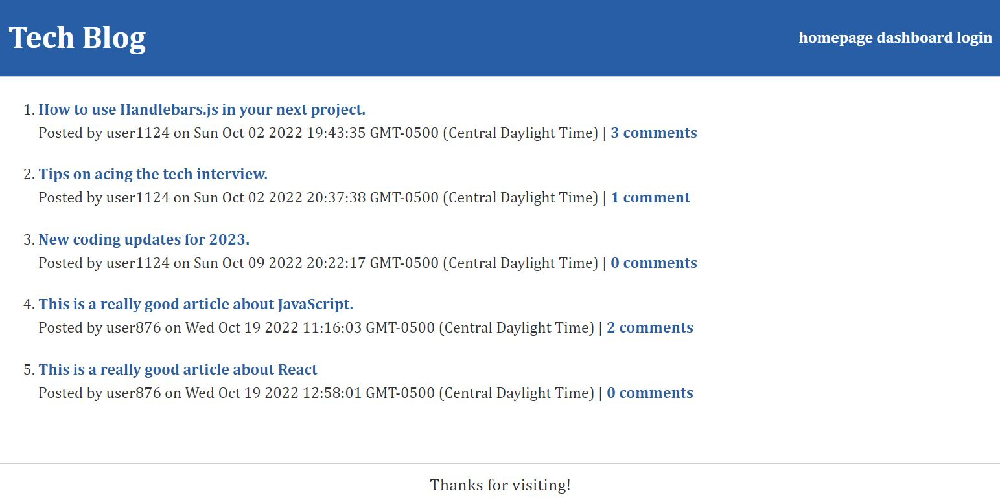

# Tech Blog

## Description: 
This CMS-style blog site is a resource for web developers and contains tech-related blog posts. Users can publish their own blog posts as well as comment on other developers' postings.

## Technologies:
Handlebars.js
MySQL / Sequelize
Express.js
dotenv
bcrypt

## Deployment:
Tech Blog is deployed on Heroku. 
https://aqueous-badlands-64708.herokuapp.com/

### &copy; Created by:  
Susan Brown